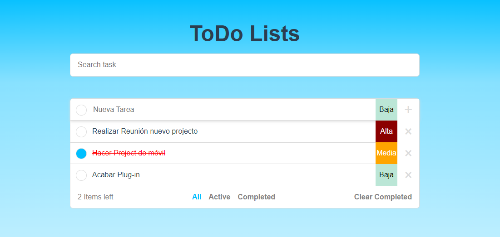
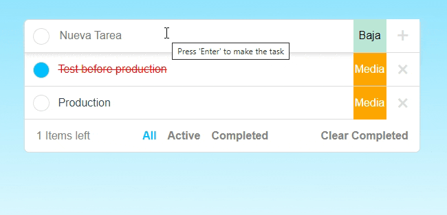
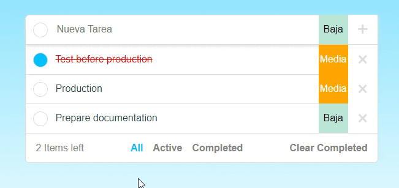
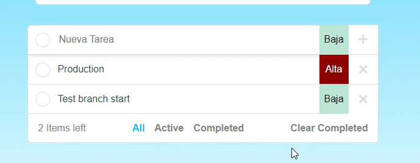

# Proyecto Vue - Recordatorios
**Project name:** ToDo List/Recordatorios
**Author:** [DainWs](https://github.com/DainWs)

This website is a list, reminder list of all your to-dos. 

You can add tasks:

Also you can filter task by these state!!

you want to change the priority of the task? Yes, you can do it!!

## Test it now!!
You can test it going to [Production](https://dainws.github.io/2DAW_ToDo_Project/)

## Project Features/Specifications
Haciendo uso de Vue como Framework de desarrollo vamos a realizar una aplicación on-line para la gestión de recordatorios (o "todos").

La aplicación debe:

- [X] Dar de alta recordatorios, los cuales tienen: descripcion de la tarea, fecha de creacion y prioridad (alta, media, baja).
- [X] Mostrar el listado de tareas dadas de alta.
- [X] Las tareas deben almacenarse en local en el navegador, de tal modo que al acceder a la web transcurrido un tiempo, automáticamente aparezcan las tareas que teníamos dadas de alta previamente.
- [X] Debe ser posible borrar una tarea.
- [X] Debe ser posible cambiar el estado de una tarea (completada o activa). Este cambio conlleva un cambio en la interfaz, apareciendo tachada la entrada correspondiente.
- [X] Debe ser posible mostrar solo las completadas, sólo las activas o todos.
- [X] Debe ser posible borrar todas las tareas completadas.
- [X] Debe mostrarse un mensaje indicando el número total de tareas y cuántas se han completado.
- [X] Se valorará una correcta interfaz, basándote en la imagen que tienes a continuación. Debe prestarse atención a aspectos como la usabilidad de la web.
- [X] Debe estar en producción.

Todos los puntos anteriores son los mínimos para alcanzar un 5 en el proyecto. El resto de puntos hasta el 10 se obitenen según los siguientes puntos:

- [X] (0,8 puntos) Al añadir o borrar tareas se realiza una pequeña animación.
- [X] (0,5 puntos) Debe ser posible cambiar la prioridad de una tarea. Para ello cada tarea muestra un pequeño botón por cada prioridad, que al pusar se actualiza.
- [X] (1 punto) Las tareas se muestran siempre ordenadas por prioridad (alta a baja).
- [X] (0,5 puntos) Cada tarea muestra los minutos pasados desde que se dió de alta.
- [X] (1,7 puntos) El proyecto se realiza con la ayuda de VueCLI y usando componentes.
- [X] (0,5 puntos) Debe ser posible filtrar tareas por nombre, de modo que solo aparezcan aquellas que contienen lo escrito en el campo usado para filtrar.

***See for more details this repository:*** [2DAW_ToDo_Project](https://github.com/DainWs/2DAW_ToDo_Project)